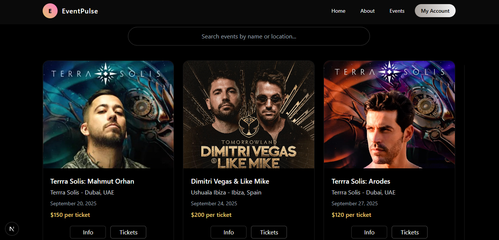

#  Event Booking App

A fully functional, web application for browsing, booking events, and generating tickets. Built with React and Tailwind CSS, it features dynamic event listings, search and filter functionality, and a streamlined booking flow.

## View Project

To view or edit the project:

```bash
git clone https://github.com/Kethnulee-Weerasinghe/Event-Booking-App.git
cd Event-Booking-App
```
## Installation & Dependencies

**Backend Setup**

```bash
cd backend
npm install
npm run dev
```

**Frontend Setup**

```bash
cd ../frontend
npm install
npm run dev
```



## Overview

This project is an event booking system (frontend + backend) designed so that:

- Users can browse upcoming events and view details  
- Users can make and cancel bookings  
- Authentication & authorization ensures correct access  

## Technologies

**Frontend**

 - JavaScript
 - React
 - Tailwind CSS
 - React icons

**Backend**

  - Node.js + Express

**Authentication**

- NextAuth.js
- bcrypt
